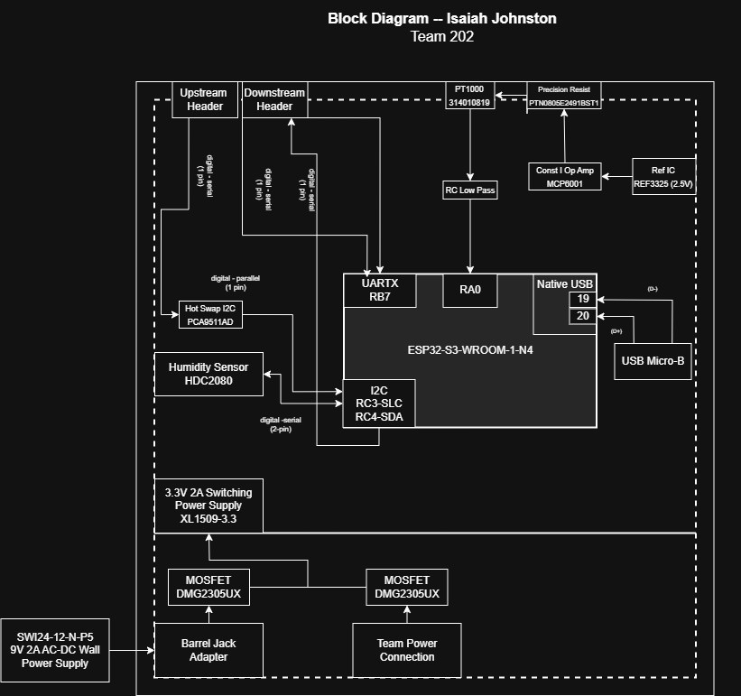

## Overview
The temperature and humidity module block diagram illustrates the overall architecture of the subsystem and its role within a daisy-chained system. The module measures temperature using a PT1000 resistance temperature detector (RTD) and relative humidity using a digital I²C humidity sensor (HDC2080), while functioning as one node in a multi-board network.

The system can be powered either from a 9 V barrel jack adapter or from the team 9 V power distribution rail. These two power sources are combined using P-channel MOSFET ideal-diode OR-ing circuitry to prevent reverse current flow between supplies. The selected 9 V input is then stepped down to 3.3 V using a switching regulator (XL1509-3.3), which powers the ESP32-S3 microcontroller and all supporting circuitry.

Temperature measurement is performed using a PT1000 RTD configured in a precision voltage-divider arrangement. The RTD is excited using a stable 2.5 V precision reference (REF3325) and a precision resistor to ensure accurate and repeatable measurements independent of supply variation. The resulting analog voltage is buffered by a unity-gain operational amplifier (MCP6001), filtered using an RC low-pass network to reduce noise, and then routed to an analog-to-digital converter (ADC) input on the ESP32-S3 for digital processing.

Relative humidity is measured using the HDC2080 digital humidity sensor, which communicates with the ESP32-S3 via the I²C interface. To ensure safe and reliable operation within the daisy-chained system, a PCA9511A hot-swap I²C buffer isolates the local I²C bus from the shared system bus. This buffer protects the network during board insertion and removal and maintains signal integrity across multiple connected nodes.

System-level communication between boards is achieved through upstream and downstream headers. These connectors pass power and digital communication lines between nodes, allowing each module to operate independently while contributing data to the overall system.

The ESP32-S3 processes both analog and digital sensor data and communicates measurements to the rest of the system. Firmware development and programming are performed through the native USB interface of the ESP32-S3 using a USB Micro-B connector.

## Block Diagram 

