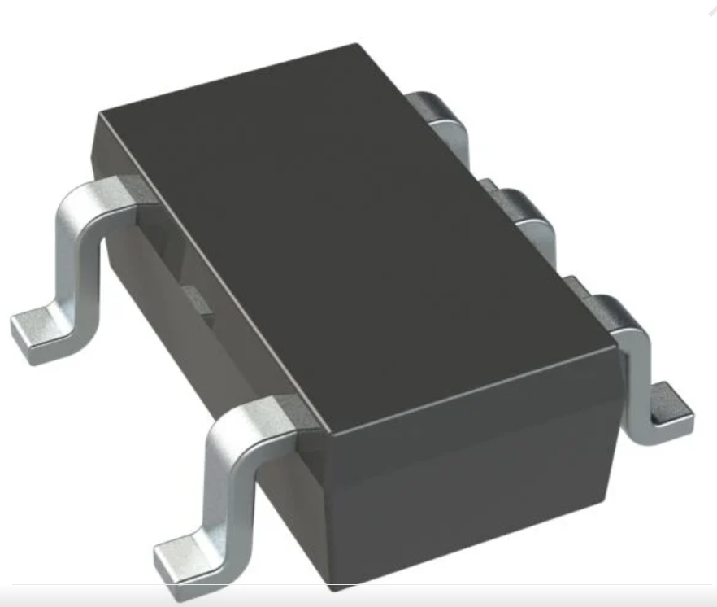
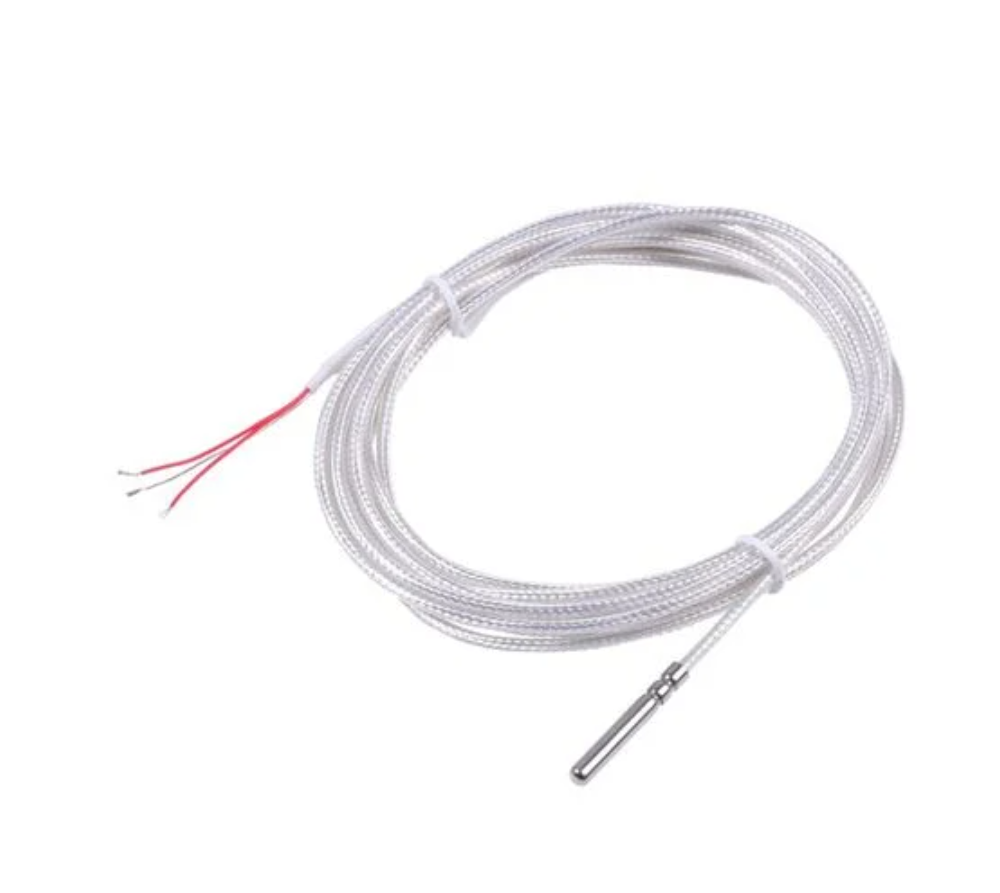
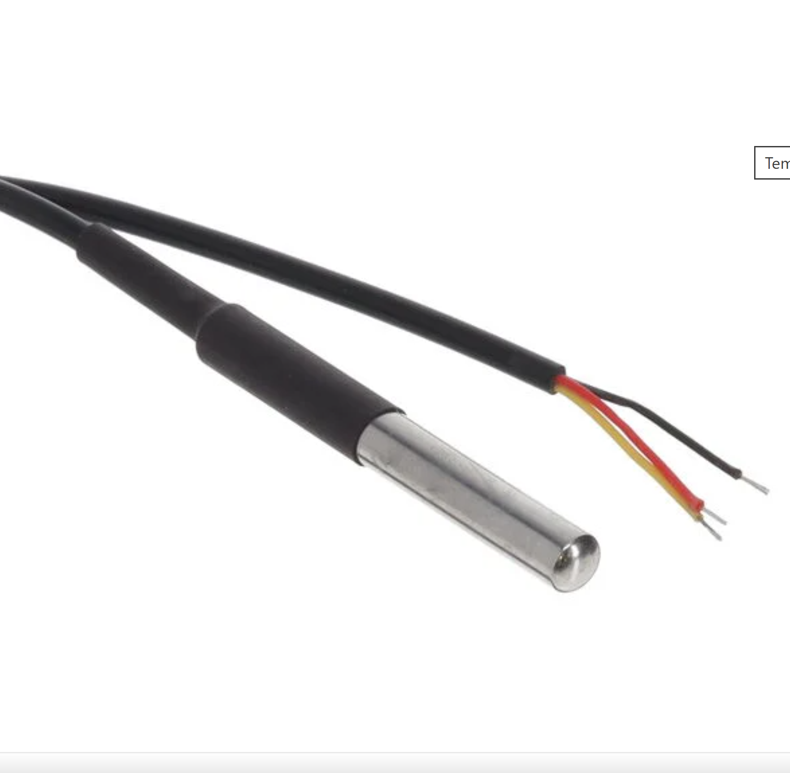
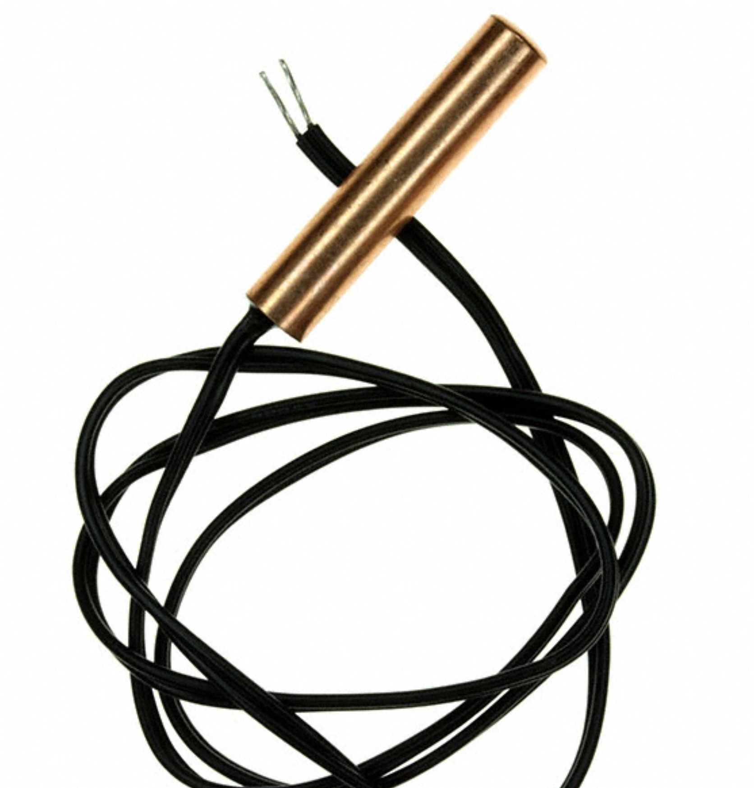

## Module's Selected Major Components

The following sections are the selected major components necessary for  .....

>**For each of the following sections, use <ins>one of the two styles</ins> given near the end. *REMOVE THIS NOTE***

### Power Regulator

(**remove this note/placeholder**: this is where your 3.3 volt switching regulator, any other needed power regulator, and power source {if applicable} **THAT WERE SELECTED**)

### Tempurature Sensor

### Humidity Sensor

### Op-Amp

### Voltage Reference IC

### Hot-Swap I2C Buffer

### MOSFET

### Precision Resistor

### Barrel Jack

### 8-Pin Connector

-----------

**Humidity Sensor**

| **Component** | **Pros** | **Cons** |
|---|---|---|
|  **SHT45-AD1B-R2A0/A1 humidity sensor** $3–4/each [link to product](link) | • High RH accuracy and long-term stability • Digital I²C output simplifies PCB design (no analog conditioning) • Low power operation suitable for embedded environmental nodes | • Higher cost than lower-accuracy RH sensors • Requires careful placement away from heat sources for accurate readings • Needs environmental protection (filter or coating) to avoid contamination drift |
|  **SHT41-AD1B humidity sensor** $2–3/each [link to product](link) | • Good accuracy-to-cost ratio • I²C interface enables simple firmware integration • Compact surface-mount package | • Slightly lower performance compared to SHT45 • Sensitive to condensation/contamination without protection • Placement airflow affects measurement accuracy |
|  **HDC3022 humidity sensor** $2–3.5/each [link to product](link) | • High accuracy alternative supply chain to Sensirion parts • I²C interface with simple integration • Stable performance across wide environmental conditions | • Requires careful layout and decoupling for best accuracy • Placement must minimize self-heating effects • Availability may vary depending on package/SKU |

**Rationale:** A clock oscillator is easier ....

**Op-Amp**

| **Component** | **Pros** | **Cons** |
|---|---|---|
|  **OPA333 precision op-amp** $2.82/each [link](https://www.digikey.com/en/products/detail/texas-instruments/OPA333AIDBVT/1004627)) | • Very low input offset voltage ideal for precision RTD current sources • Zero-drift architecture provides excellent long-term stability • Rail-to-rail input/output operation suitable for low-voltage systems | • Higher cost than general-purpose op-amps • Limited bandwidth compared to high-speed amplifiers • Slightly higher quiescent current than ultra-low-power options |
|  **MCP6001 general-purpose op-amp** $0.40/each [link](https://www.digikey.com/en/products/detail/microchip-technology/MCP6001T-E-OT/1979833?gclsrc=aw.ds&gad_source=4&gad_campaignid=20228387720&gbraid=0AAAAADrbLlhNtrIkwPp0OiJmv8l7g3KB3&gclid=CjwKCAiAkbbMBhB2EiwANbxtbXV5fqL9M9kqF_H6gamELeyg9kteB0eufRAYaOHZXDlToHE7oz6ajRoCPDAQAvD_BwE)) | • Very low cost and widely available • Rail-to-rail operation works well in 3.3 V systems • Low power consumption suitable for battery-powered nodes | • Higher offset voltage reduces precision for RTD circuits • Lower accuracy over temperature compared to precision op-amps • Moderate noise performance for sensitive measurement circuits |
|  **LT6015 precision op-amp** $2.50/each [link](https://www.digikey.com/en/products/detail/analog-devices-inc/LT6015HS5-TRPBF/8040793) | • Very low offset voltage and drift suitable for precision current generation • Excellent noise performance for accurate sensor measurements • Good temperature stability across wide ranges | • Higher cost than low-power devices • Slightly higher power consumption • May be unnecessary for moderate-accuracy environmental sensing |

**Rationale:** A clock oscillator is easier ....

**Voltage Reference IC**

| **Component** | **Pros** | **Cons** |
|---|---|---|
|  **ADR4525 precision reference** $3.50/each [link to product](link) | • Very low temperature drift for stable ADC measurements • High initial accuracy supports consistent calibration • Low noise improves precision readings | • Higher cost than basic references • Requires careful PCB layout and decoupling • Fixed output voltage |
|  **TL431A adjustable reference** $0.20/each [link to product](link) | • Very inexpensive and widely available • Adjustable output using external resistors • Useful as reference or regulator | • Higher noise and drift • Requires bias current to operate • Accuracy depends on external components |
|  **REF3325 precision reference** $1.60/each [link to product](link) | • Low quiescent current ideal for battery systems • Good accuracy and low drift • Compatible with many ADC ranges | • Not as low-drift as premium references • Limited output current capability • Requires clean layout for best performance |

**Rationale:** A clock oscillator is easier ....

**Hot-Swap I2C Buffer**

| **Component** | **Pros** | **Cons** |
|---|---|---|
|  **TCA4311A I²C buffer** $1.40/each [link to product](link) | • Enables live insertion/removal of I²C devices • Built-in rise-time accelerator improves signal integrity • Minimal external components required | • Adds small propagation delay • Must be placed near connector boundary • Signal-level protection only |
|  **PCA9511A I²C buffer** $1.20/each [link to product](link) | • Industry-standard hot-swap solution • Protects bus during hot-plug events • Supports standard and fast I²C modes | • Increases bus capacitance slightly • Limited diagnostics • Requires proper pull-up sizing |
|  **LTC4300A I²C buffer** $2.00/each [link to product](link) | • Bus pre-charge minimizes insertion glitches • Good for industrial environments • Helps isolate faulty downstream devices | • Slightly higher cost • Requires careful layout • Additional design considerations for segmentation |

**Rationale:** A clock oscillator is easier ....

**Power Regulator**

| **Component** | **Pros** | **Cons** |
|---|---|---|
|  **XL1509-3.3 buck regulator** $1/each [link to product](link) | • Simple fixed 3.3 V design • Handles high input voltages • Low cost | • Lower switching frequency requires larger passives • Higher ripple/EMI • Lower efficiency at light loads |
|  **TPS62172 synchronous buck** $3/each [link to product](link) | • High efficiency across load range • Smaller external components • Cleaner output rail | • Higher cost • Requires careful layout • Narrower input range |
|  **MP1584EN buck regulator** $1.50/each [link to product](link) | • Good performance for cost • Smaller magnetics than older regulators • Widely used design option | • EMI depends heavily on layout • Variant documentation differences • Not ultra-low-noise |

**Rationale:** A clock oscillator is easier ....

**MOSFET**

| **Component** | **Pros** | **Cons** |
|---|---|---|
|  **AO3407A P-MOSFET** $0.30/each [link to product](link) | • Low Rds(on) for efficient switching • Compact SOT-23 package • Common high-side switching device | • Limited current handling • Thermal limits of small package • Gate-drive margin must be verified |
|  **SI2301CDS P-MOSFET** $0.40/each [link to product](link) | • Good balance of cost and performance • Widely available • Suitable for 3.3 V and 5 V switching | • Slightly higher Rds(on) • Limited dissipation capability • Requires gate resistor design |
|  **DMG2305UX P-MOSFET** $0.50/each [link to product](link) | • Very low on-resistance • Compact package • Good for moderate current switching | • Thermal limitations • Gate-threshold must be checked • Slightly higher cost |

**Rationale:** A clock oscillator is easier ....

**Temperature Sensor**

| **Component** | **Pros** | **Cons** |
|---|---|---|
|  **PT1000 Temperature Sensor Probe (1597-314010819-ND)** $9.90/each [link to product](link) | • Very high accuracy and long-term stability • Excellent repeatability • Wide temperature range (−200°C to 600°C) • Easy calibration | • Requires precision current source • More expensive than thermistors or digital sensors • Wiring resistance must be compensated |
|  **Digital Temperature Probe (SNS-TMP-DS18B20-MAXIM)** $5.33/each [link to product](link) | • Simple PCB interface • No precision analog circuitry required • Factory calibrated | • Slower response time than exposed RTD • Accuracy lower than PT1000 • Less stable long-term |
|  **THERM NTC 10KOHM 3988K Probe (B57800K0103A001)** $5.22/each [link to product](link) | • Least expensive • High sensitivity • Simple voltage divider readout | • Non-linear resistance, needs calibration • Accuracy depends heavily on calibration • Self-heating errors if measurement current is too high |

**Rationale**

**Precision Resistor**

| **Component** | **Pros** | **Cons** |
|---|---|---|
|  **PATT0603E1002BGT1 thin-film resistor** $0.80/each [link to product](link) | • High precision tolerance (0.1%) suitable for sensor reference networks • Good temperature stability (10–25 ppm/°C) for consistent measurements • Compact 0603 SMD package ideal for small PCB layouts | • Lower power handling compared to larger package resistors • More expensive than standard thick-film resistors • Long-term drift is higher than ultra-precision metal-foil resistors |
|  **Y145310K0000T9L metal foil resistor** $40.00/each [link to product](link) | • Extremely high precision (0.01% tolerance) • Very low temperature coefficient (~2 ppm/°C) for highly stable measurements • Excellent long-term stability and minimal drift | • Significantly more expensive than thin-film precision resistors • Larger footprint compared to standard SMD thin-film resistors • Performance benefits may exceed requirements for typical embedded sensor applications |
|  **RC0603BR-0710KL thin-film resistor** $0.10/each [link to product](link) | • Low cost while maintaining 0.1% precision tolerance • Good temperature stability (~25 ppm/°C) suitable for sensor reference networks • Small SMD package ideal for compact PCB layouts | • Moderate long-term drift compared to metal-foil precision resistors • Limited power dissipation due to small 0603 package • Accuracy can be affected by PCB thermal gradients if placed near heat sources |

**Rationale**

**Barrel Jack**

| **Component** | **Pros** | **Cons** |
|---|---|---|
|  **PJ-102A barrel jack** $0.80/each [link to product](link) | • Very common connector footprint • Through-hole mounting provides strong mechanical stability • Suitable for moderate current DC input | • Larger footprint than smaller connectors • Not sealed against moisture or debris • Limited retention strength compared to locking connectors |
|  **PJ-037A barrel jack** $1.00/each [link to product](link) | • Compact form factor • Good mechanical anchoring for PCB mounting • Widely available from multiple vendors | • Slightly lower current rating • Reduced robustness under repeated insertion cycles • Requires enclosure support |
|  **CUI PJ-002A barrel jack** $1.20/each [link to product](link) | • Reliable manufacturer support and documentation • Strong PCB retention due to through-hole mounting • Compatible with standard 5.5 mm / 2.1 mm plugs | • Larger PCB area required • No built-in locking mechanism • Exposed contacts can collect dust/moisture |

**Rationale**

**8-Pin Connector**

| **Component** | **Pros** | **Cons** |
|---|---|---|
|  **JST XH B8B-XH-A connector** $0.40/each [link to product](link) | • Locking friction ramp improves retention • Widely available and easy to assemble • Good for low-cost sensor harnesses | • Larger PCB footprint • Not sealed for outdoor environments • Limited current rating per pin |
|  **61300811121 right-angle header** $0.60/each [link to product](link) | • Simple, robust, easy to source • Compatible with standard jumper wires • Low vertical height in enclosures | • No locking mechanism • Not suitable for vibration environments • Exposed pins susceptible to corrosion |
|  **JST GH BM08B-GHS-TBT connector** $0.80/each [link to product](link) | • Compact footprint saves PCB space • Positive latch improves vibration resistance • Good for production harnesses | • Requires specialized crimp tools • Harder to hand-solder due to fine pitch • Not sealed without additional protection |

