## Module's Selected Major Components

The following sections compare the major components required for sensing soil temperature and relative humidity, communicating with the CropScout system, and regulating power from the system power rail. To minimize total system cost while maintaining adequate sensing accuracy and operational reliability, the design selects the PT1000 temperature probe, HDC2080 humidity sensor, MCP6001 op-amp, REF3325 voltage reference, LM2675MX-3.3 switching regulator, RC1206FR-7W10KL precision resistor, PJ-102AH barrel jack, and PH1-16-UA header connector, providing an effective overall cost-to-performance balance for the CropScout sensing module.

-----------

**Humidity Sensor**

| **Component** | **Pros** | **Cons** |
|---|---|---|
| 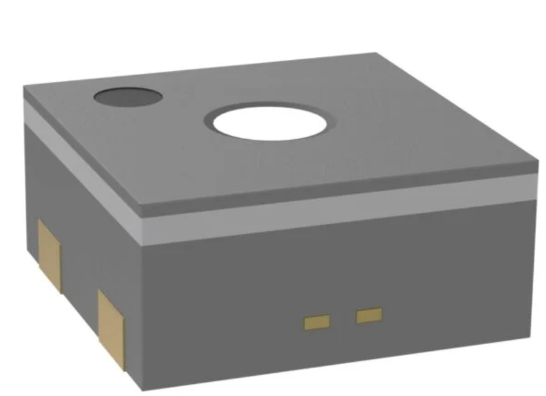 **SHT45-AD1B-R2A0/A1 humidity sensor** $5.54/each [link](https://www.digikey.com/en/products/detail/sensirion-ag/SHT45-AD1B-R2/16360969?gclsrc=aw.ds&gad_source=4&gad_campaignid=20232005509&gbraid=0AAAAADrbLlhvjO3S2T4wJVM4nKnQCtGe4&gclid=CjwKCAiAkbbMBhB2EiwANbxtbR30zFlR6-ISnKVzKA9TfFOxo3CsswTxviwWlwFFxJSoi6N8-PF84hoCQ5cQAvD_BwE) | • High RH accuracy and long-term stability • Digital I²C output simplifies PCB • Low power operation | • Highest cost • Requires careful placement away from heat sources for accurate readings • Needs environmental protection (filter or coating) to avoid contamination drift |
| 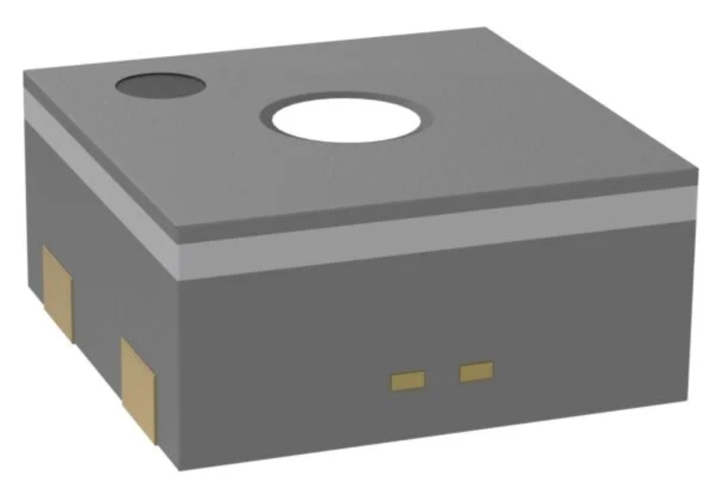 **SHT41-AD1B humidity sensor** $2.84/each [link](https://www.digikey.com/en/products/detail/sensirion-ag/SHT41-AD1B-R3/15296599) | • Good accuracy • I²C interface enables simple firmware integration • Smaller performance trade-off compared to SHT45 | • Worse long-term stability than SHT45 • Sensitive to condensation/contamination without protection • More expensive than lower-accuracy humidity sensors |
| 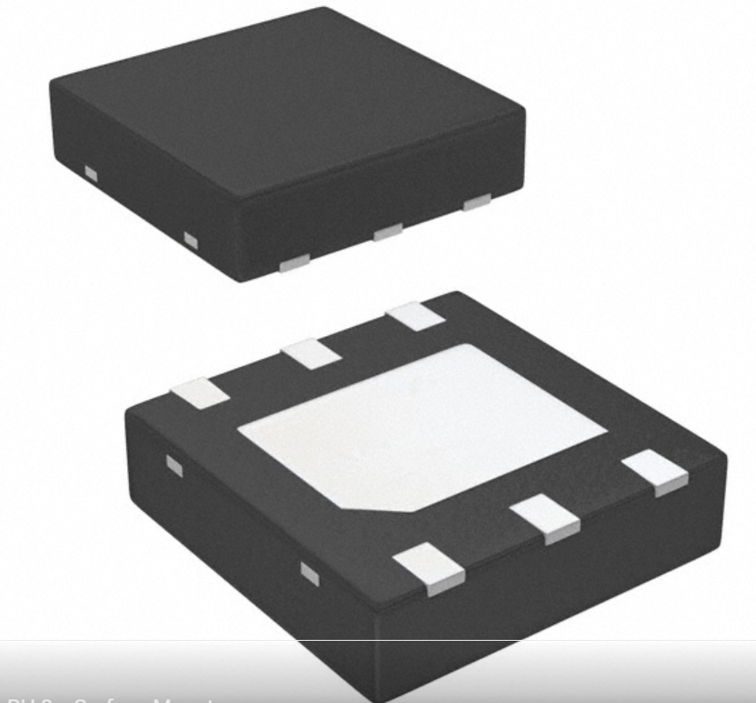 **HDC2080 humidity sensor** $1.94/each [link](https://www.digikey.com/en/products/detail/texas-instruments/HDC2080DMBR/9860135?gclsrc=aw.ds&gad_source=4&gad_campaignid=20232005509&gbraid=0AAAAADrbLlhvjO3S2T4wJVM4nKnQCtGe4&gclid=CjwKCAiAkbbMBhB2EiwANbxtbY5duiewVzGNgl5dhdKb6f7xtAyPZq1Vo0maRoVvSNwXd1f-4QeO-RoCcEMQAvD_BwE) | • Lowest cost • I²C interface with simple integration • Stable performance across wide environmental conditions | • Requires careful layout and decoupling for best accuracy • Placement must minimize self-heating effects • Lowest long-term stability |

**Rationale:** The HDC2080 is selected for its low cost. The accuracy is sufficient for monitoring field humidity.

---

**Op-Amp**

| **Component** | **Pros** | **Cons** |
|---|---|---|
| 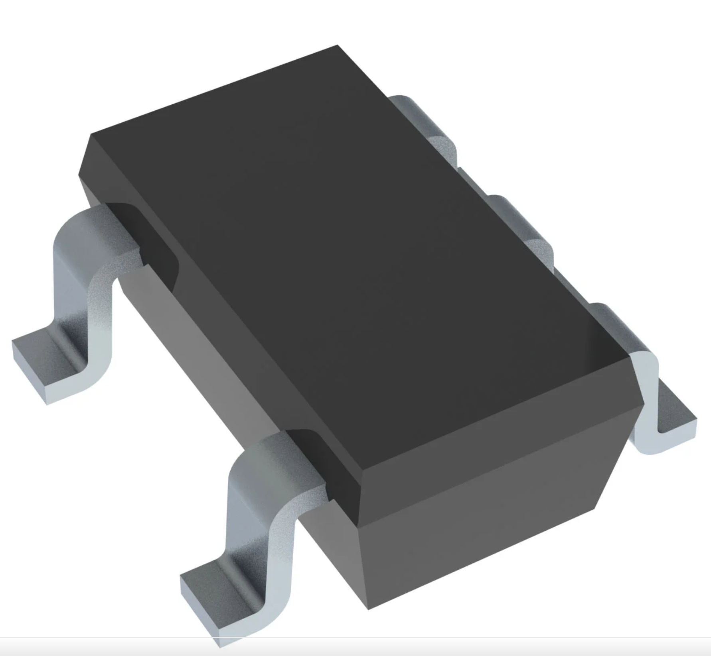 **OPA333 precision op-amp** $2.82/each [link](https://www.digikey.com/en/products/detail/texas-instruments/OPA333AIDBVT/1004627) | • Very low input offset voltage ideal for precision RTD current sources • Zero-drift architecture provides excellent long-term stability • Rail-to-rail input/output operation suitable for low-voltage systems | • Higher cost than general purpose op-amps • Limited bandwidth compared to high-speed amplifiers • Slightly higher quiescent current than ultra low power options |
| 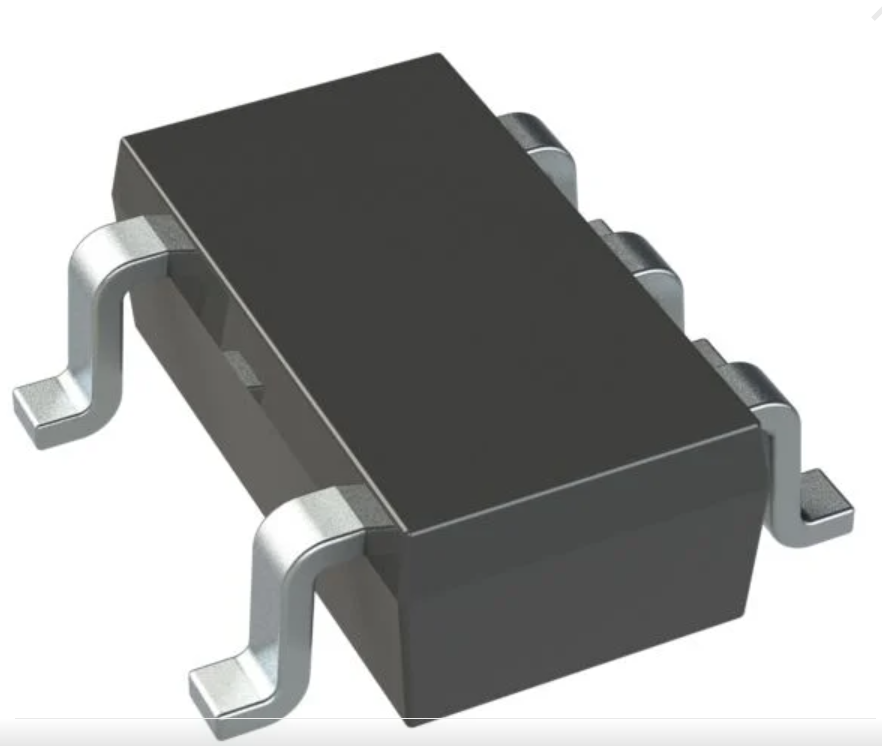 **MCP6001 general-purpose op-amp** $0.40/each [link](https://www.digikey.com/en/products/detail/microchip-technology/MCP6001T-E-OT/1979833) | • Lowest cost • Rail-to-rail operation works well in 3.3 V systems • Low power consumption suitable for battery-powered nodes | • Higher offset voltage reduces precision for RTD circuits • Lower accuracy over temperature compared to precision op-amps • Moderate noise performance for sensitive measurement circuits |
| 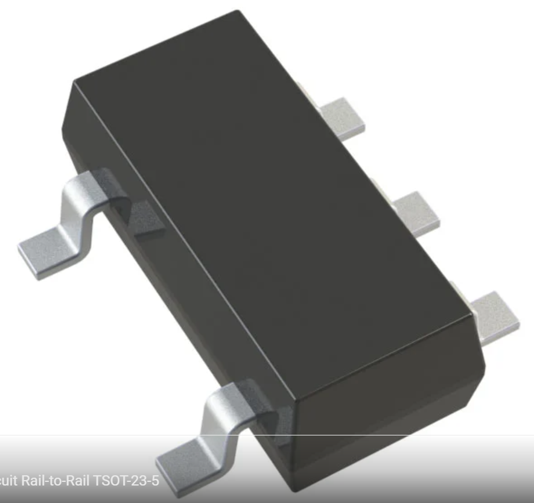 **LT6015 precision op-amp** $2.50/each [link](https://www.digikey.com/en/products/detail/analog-devices-inc/LT6015HS5-TRPBF/8040793) | • Very low offset voltage and drift suitable for precision current generation • Excellent noise performance for accurate sensor measurements • Good temperature stability across wide ranges | • Higher cost than low-power devices • Slightly higher power consumption • May be unnecessary for moderate-accuracy environmental sensing |

**Rationale:** The MCP6001 is selected for its low cost while still providing rail-to-rail operation and low power consumption.

---

**Voltage Reference IC**

| **Component** | **Pros** | **Cons** |
|---|---|---|
| 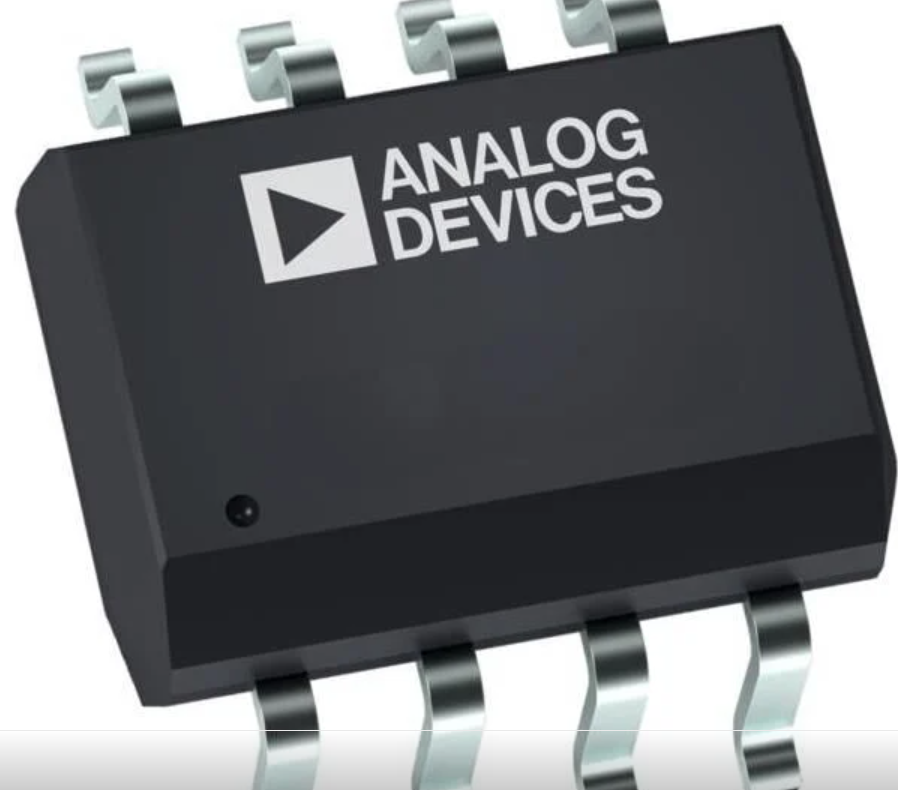 **ADR4525 precision reference** $10.55/each [link](https://www.digikey.com/en/products/detail/analog-devices-inc/ADR4525BRZ-R7/4141690) | • Very low temperature drift for stable ADC measurements • High initial accuracy supports consistent calibration • Low noise improves precision readings | • Higher cost than basic references • Requires careful PCB layout and decoupling • Fixed output voltage |
|  **TL431A adjustable reference** $0.10/each [link](https://www.digikey.com/en/products/detail/evvo/TL431A/21406979) | • Very inexpensive and widely available • Adjustable output using external resistors • Useful as reference or regulator | • Higher noise and drift • Requires bias current to operate • Accuracy depends on external components |
| 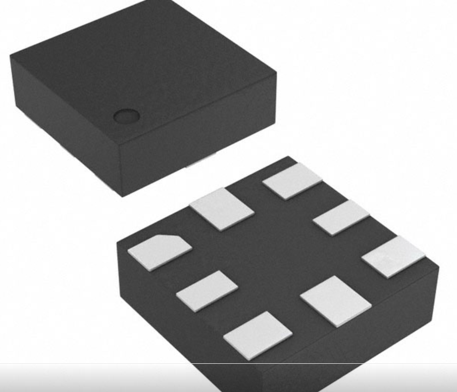 **REF3325 precision reference** $2.18/each [link](https://www.digikey.com/en/products/detail/texas-instruments/REF3325AIRSER/5034447) | • Low quiescent current ideal for battery systems • Good accuracy and low drift • Compatible with many ADC ranges | • Not as low-drift as premium references • Limited output current capability • Requires clean layout for best performance |

**Rationale:** The REF3325 was selected for its balance between precision performance and cost.

---

**Power Regulator**

| **Component** | **Pros** | **Cons** |
|---|---|---|
| **LM2675MX-3.3/NOPB buck regulator** | • Fixed 3.3 V output simplifies design • High current capability suitable for microcontroller systems • Good efficiency for battery or adapter powered systems | • Requires external inductor and diode • Larger footprint than newer regulators • Switching noise must be managed with proper layout |
| **TPS62172 synchronous buck** | • High efficiency across load range • Smaller external components • Cleaner output rail | • Higher cost • Requires careful layout • Narrower input range |
| **MP1584EN buck regulator** | • Good performance for cost • Smaller magnetics than older regulators • Widely used design option | • EMI depends heavily on layout • Variant documentation differences • Not ultra-low-noise |

**Rationale:** The LM2675MX-3.3/NOPB was selected because it provides a reliable fixed 3.3 V rail capable of supplying the ESP32-S3 and supporting circuitry while maintaining stable performance across a wide input-voltage range.

---

**Temperature Sensor**

| **Component** | **Pros** | **Cons** |
|---|---|---|
| 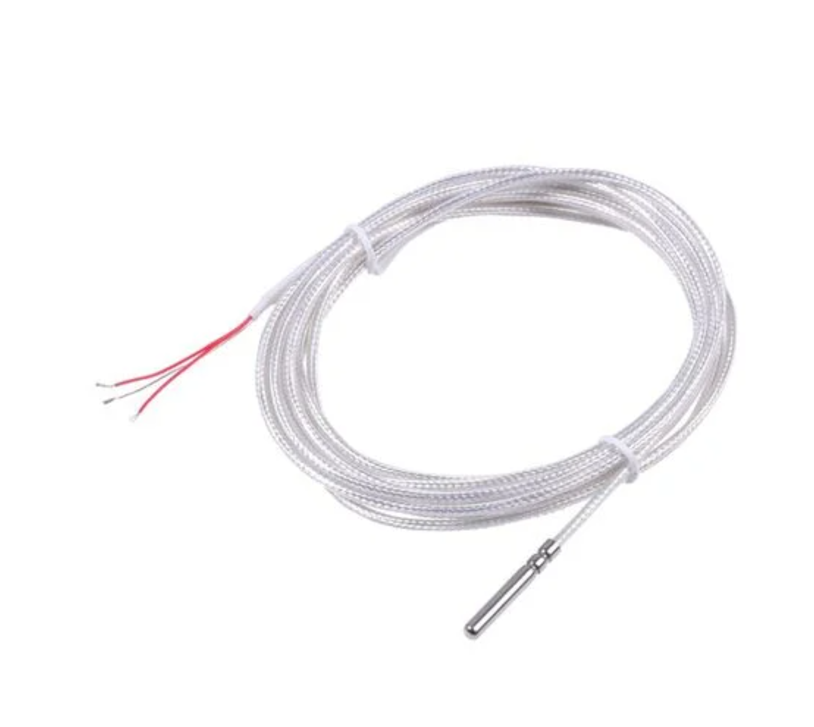 **PT1000 Temperature Sensor Probe (1597-314010819-ND)** $9.90/each [link](https://www.digikey.com/en/products/detail/seeed-technology-co-ltd/314010819/22109375) | • Very high accuracy and long-term stability • Excellent repeatability • Wide temperature range (−200°C to 600°C) • Easy calibration | • Requires precision current source • More expensive than thermistors or digital sensors • Wiring resistance must be compensated |
| 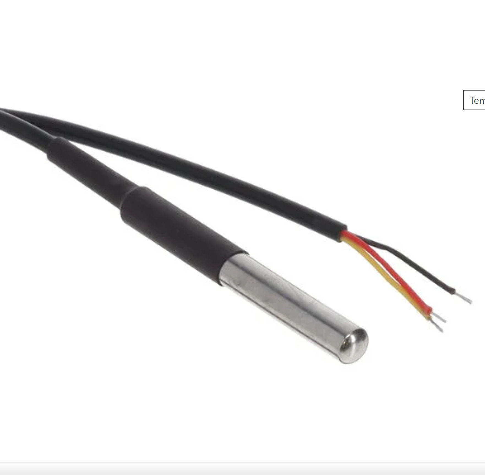 **Digital Temperature Probe (SNS-TMP-DS18B20-MAXIM)** $5.33/each [link](https://www.digikey.com/en/products/detail/olimex-ltd/SNS-TMP-DS18B20-MAXIM/21662296) | • Simple PCB interface • No precision analog circuitry required • Factory calibrated | • Slower response time than exposed RTD • Accuracy lower than PT1000 • Less stable long-term |
| 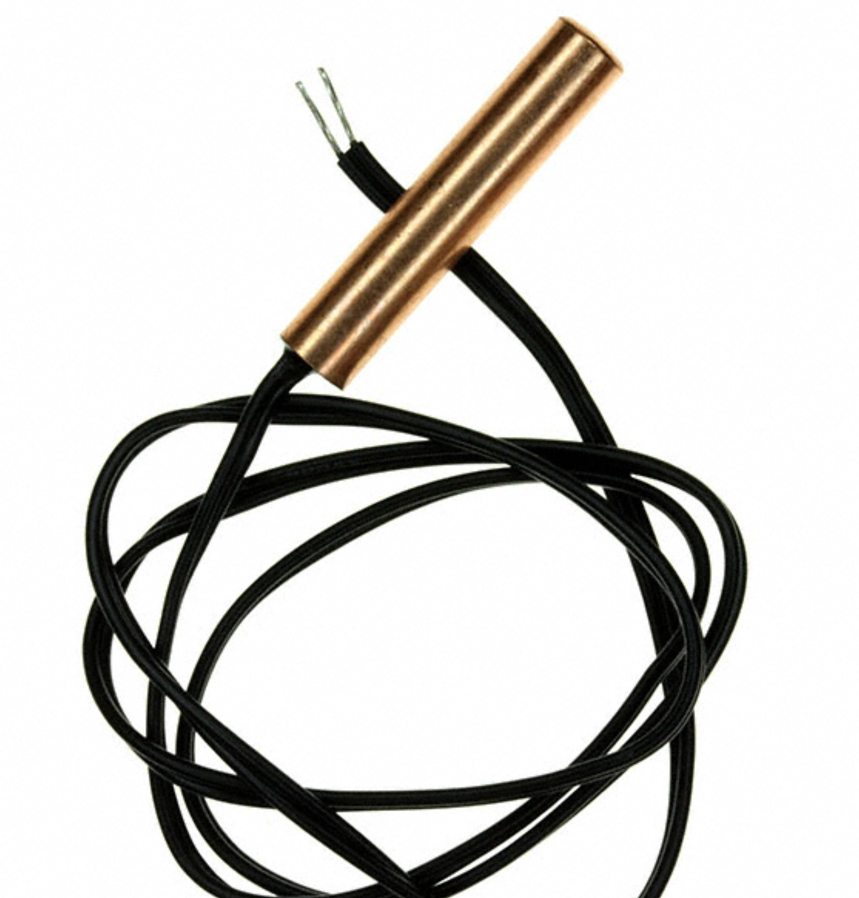 **THERM NTC 10KOHM 3988K Probe (B57800K0103A001)** $5.22/each [link](https://www.digikey.com/en/products/detail/epcos-tdk-electronics/B57800K0103A001/7099969) | • Least expensive • High sensitivity • Simple voltage divider readout | • Non-linear resistance, needs calibration • Accuracy depends heavily on calibration • Self-heating errors if measurement current is too high |

**Rationale:** The PT1000 temperature probe was selected because it provides the best accuracy, repeatability, and long-term stability for soil temperature measurement.

---

**Precision Resistor**

| **Component** | **Pros** | **Cons** |
|---|---|---|
| **RC1206FR-7W10KL precision resistor** | • 1% tolerance suitable for voltage-divider measurement circuits • Larger 1206 package improves thermal stability • Very low cost | • Not as precise as 0.1% thin-film resistors • Larger footprint than smaller packages • Moderate long-term drift |

**Rationale:** The RC1206FR-7W10KL resistor was selected because it provides adequate stability and low cost while meeting the requirements of the RTD voltage divider.

---

**Barrel Jack**

| **Component** | **Pros** | **Cons** |
|---|---|---|
| **PJ-102AH barrel jack** | • Common DC power connector • Through-hole mounting provides strong mechanical support • Compatible with standard 5.5 mm / 2.1 mm plugs | • Larger footprint than smaller connectors • Not sealed against dust or moisture • No locking mechanism |

**Rationale:** The PJ-102AH barrel jack was selected because it provides a reliable and inexpensive method of supplying external power to the board.

---

**Board Connector**

| **Component** | **Pros** | **Cons** |
|---|---|---|
| **PH1-16-UA header connector** | • Simple and inexpensive • Compatible with standard jumper wires • Easy to solder and prototype | • No locking mechanism • Exposed pins susceptible to corrosion • Not ideal for vibration environments |

**Rationale:** The PH1-16-UA header connector was selected because it provides a simple and low-cost method of connecting the module to the rest of the system.
