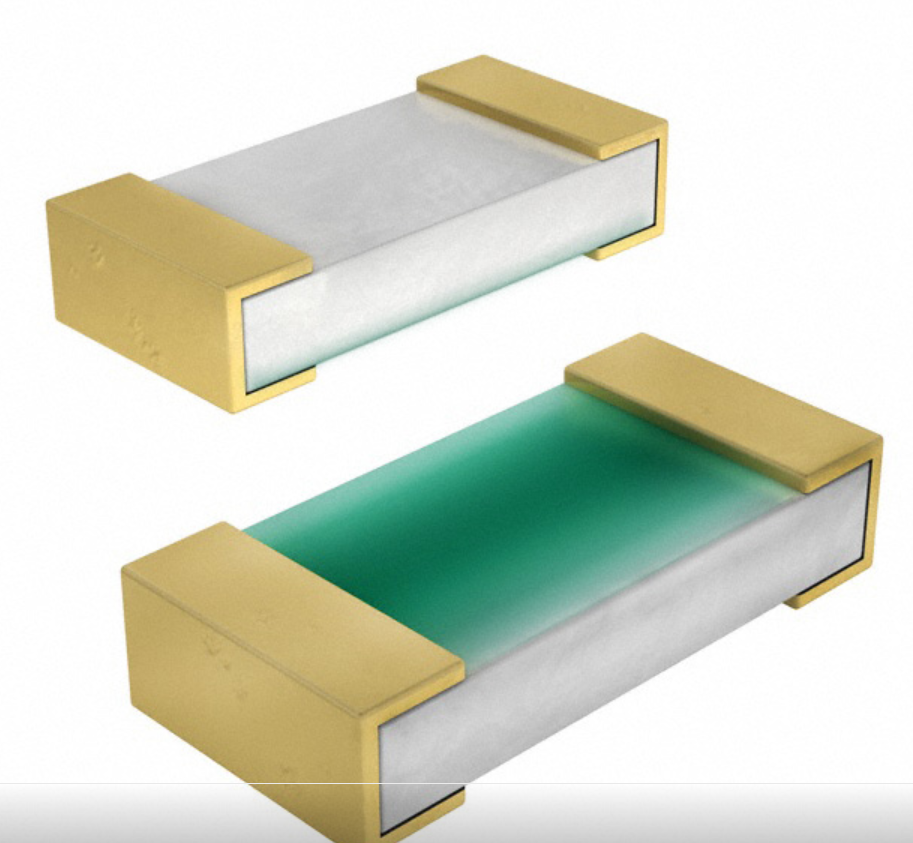
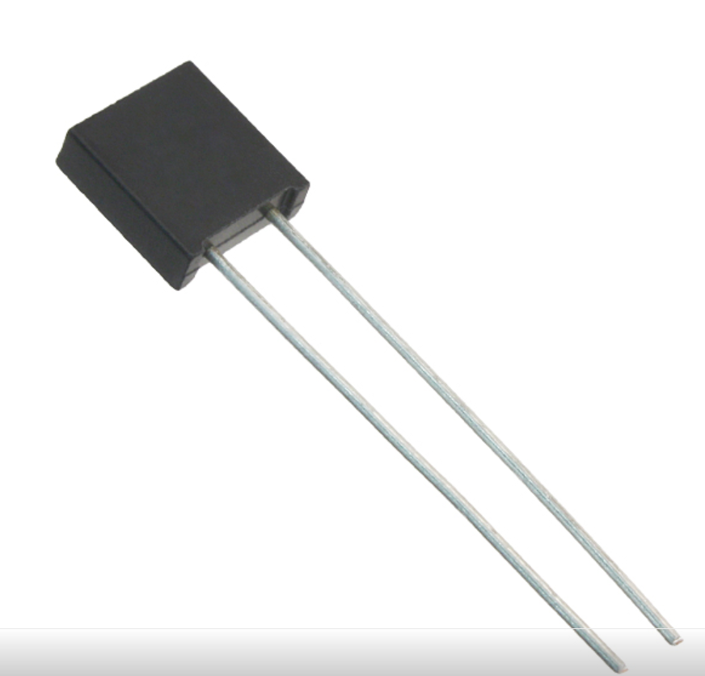

## Module's Selected Major Components

The following sections compare the major components required for sensing soil temperature and relative humidity, communicating with the CropScout system, and regulating power from the system power rail. To minimize total system cost while maintaining adequate sensing accuracy and operational reliability, the design selects the PT1000 temperature probe, HDC2080 humidity sensor, MCP6001 op-amp, REF3325 voltage reference, LM2675MX-3.3 switching regulator, RC1206FR-7W10KL precision resistor, PJ-102AH barrel jack, and PH1-16-UA header connectors, providing an effective overall cost-to-performance balance for the CropScout sensing module.

---

## Humidity Sensor

| **Component** | **Pros** | **Cons** |
|---|---|---|
|  **SHT45-AD1B-R2A0/A1 humidity sensor** $5.54/each | • High RH accuracy and long-term stability • Digital I²C output simplifies PCB • Low power operation | • Highest cost • Requires careful placement away from heat sources • Requires environmental protection |
|  **SHT41-AD1B humidity sensor** $2.84/each | • Good accuracy • I²C interface simplifies firmware integration • Reasonable cost | • Slightly lower long-term stability than SHT45 • Sensitive to contamination • Still more expensive than lower accuracy sensors |
|  **HDC2080 humidity sensor** $1.94/each | • Lowest cost • I²C interface simplifies integration • Good performance for environmental sensing | • Requires careful PCB layout • Sensitive to self-heating placement • Lower long-term stability |

**Rationale:** The HDC2080 is selected because it provides adequate accuracy for monitoring field humidity while maintaining the lowest cost.

---

## Op-Amp

| **Component** | **Pros** | **Cons** |
|---|---|---|
|  **OPA333 precision op-amp** | • Extremely low offset voltage • Excellent stability • Rail-to-rail operation | • Higher cost • Limited bandwidth |
|  **MCP6001 general-purpose op-amp** | • Very low cost • Rail-to-rail operation • Low power consumption | • Higher offset voltage • Moderate noise |
|  **LT6015 precision op-amp** | • Very low noise • Excellent stability | • Higher cost • Higher power consumption |

**Rationale:** The MCP6001 is selected because it provides rail-to-rail operation and low power consumption while maintaining the lowest cost.

---

## Voltage Reference IC

| **Component** | **Pros** | **Cons** |
|---|---|---|
|  **ADR4525 precision reference** | • Extremely stable output • Very low temperature drift | • High cost |
|  **TL431A adjustable reference** | • Very inexpensive • Flexible output voltage | • Higher noise • Requires external resistors |
|  **REF3325 precision reference** | • Good accuracy • Low drift • Low power consumption | • Limited output current |

**Rationale:** The REF3325 was selected because it provides a strong balance of precision performance and cost.

---

## Power Regulator

| **Component** | **Pros** | **Cons** |
|---|---|---|
| **LM2675MX-3.3/NOPB buck regulator** | • Fixed 3.3 V output simplifies design • High current capability • Reliable switching regulator design | • Requires external inductor and diode • Larger footprint |
| **TPS62172 synchronous buck** | • High efficiency • Smaller components | • Higher cost |
| **MP1584EN buck regulator** | • Good performance • Widely used | • Layout sensitive EMI |

**Rationale:** The LM2675MX-3.3/NOPB was selected because it reliably generates the required 3.3 V rail while supporting the ESP32-S3 and other circuitry.

---

## Temperature Sensor

| **Component** | **Pros** | **Cons** |
|---|---|---|
|  **PT1000 Temperature Sensor Probe** | • High accuracy • Excellent repeatability • Wide temperature range | • Requires precision measurement circuit |
|  **DS18B20 digital temperature probe** | • Simple digital interface • Factory calibrated | • Lower accuracy |
|  **NTC 10k thermistor probe** | • Lowest cost • High sensitivity | • Non-linear response |

**Rationale:** The PT1000 temperature probe was selected because it offers the best accuracy and long-term stability for soil temperature measurement.

---

## Precision Resistor

| **Component** | **Pros** | **Cons** |
|---|---|---|
| **RC1206FR-7W10KL precision resistor** | • Low cost • Good stability • Larger package improves thermal stability | • Not as precise as thin-film resistors |
|  **PATT0603E1002BGT1 thin-film resistor** | • Very high precision (0.1%) • Excellent temperature stability | • Higher cost |
|  **Y145310K0000T9L metal-foil resistor** | • Extremely high precision • Very low drift | • Extremely expensive |

**Rationale:** The RC1206FR-7W10KL resistor was selected because it provides adequate stability and accuracy while maintaining the lowest cost.

---

## Barrel Jack

| **Component** | **Pros** | **Cons** |
|---|---|---|
| **PJ-102AH barrel jack** | • Common DC connector • Through-hole mechanical strength • Compatible with standard 5.5 mm / 2.1 mm plugs | • Larger footprint |
| **PJ-102A barrel jack** | • Common footprint • Good mechanical stability | • Slightly larger footprint |
| **PJ-037A barrel jack** | • Compact size | • Lower current rating |

**Rationale:** The PJ-102AH barrel jack was selected because it provides a reliable and inexpensive DC input connector with strong mechanical mounting.

---

## Board Connectors

| **Component** | **Pros** | **Cons** |
|---|---|---|
| **PH1-16-UA header connector** | • Simple design • Low cost • Easy to solder and prototype | • No locking mechanism |
| **JST XH B8B-XH-A connector** | • Locking connector improves retention • Widely available | • Larger footprint |
| **JST GH BM08B-GHS-TBT connector** | • Compact design • Good vibration resistance | • Requires special crimp tools |

**Rationale:** The PH1-16-UA header connectors were selected because they provide the simplest and lowest-cost method for connecting the module to the daisy-chained system while remaining easy to assemble and test.
