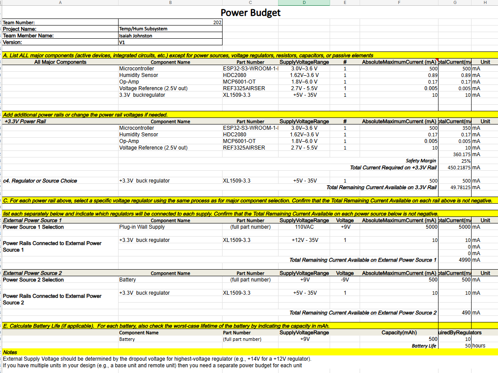

## Overview
Below is the Power Budget Of the Temperature / Humidity sensor subsystem. The power budget aids in descibing the power needs of the subsystem.

## Use
This power budget was used to conclude a 1 amp fuse would be adaquate for protecting the esp32 and and allowing the full functioning of the circuit.

## Power Budget
{style width: "2000"}
**Figure ##:** Temperature/Humidity Subsystem Power Budget.

## Resouce

The Power Budget as a PDF download is available [*here*](POWB.pdf).
