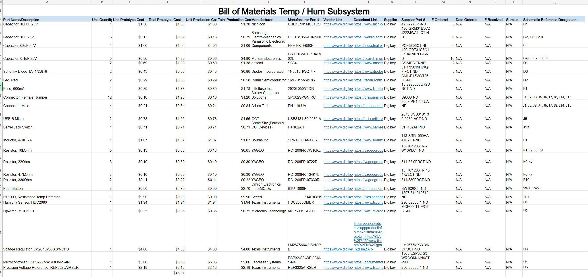

## Overview
Below is the Bill of Materials containing the parts required to build the tempurature / humidity sensing subsystem

## Bill of Materials
{style width: "2000"}
**Figure ##:** Temperature/Humidity Subsystem BOM.

## Resouce

The Bill of Material as a PDF download is available [*here*](BOMTemV2.pdf).
