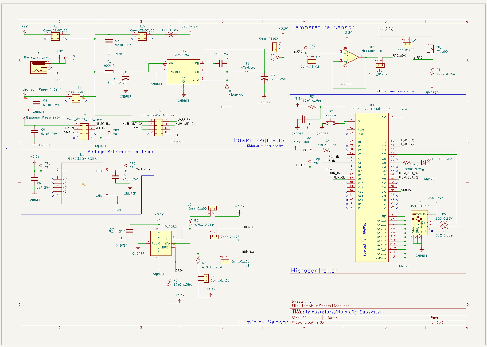

## Overview

This schematic supports the implementation of the Temperature and Humidity Subsystem module. The board can be powered either independently using a 9 V wall adapter through a barrel jack or through the team’s shared 9 V system rail. These two inputs are combined using P-channel MOSFET power OR-ing, which prevents reverse current flow between sources.

The combined 9 V rail (system rail) is passed through to the downstream board in the system. A local fuse protects only this board’s circuitry from overcurrent conditions. The fused 9 V rail is then regulated down to 3.3 V using a switching regulator (LM2675MX-3.3/NOPB buck converter).

The regulated 3.3 V rail powers the ESP32-S3 microcontroller and all onboard sensors and support circuitry.

The humidity sensor (HDC2080) communicates with the ESP32-S3 over the I²C bus using pull-up resistors to ensure stable communication.

Temperature is measured using a PT1000 resistance temperature detector (RTD). The RTD is driven from a precision 2.5 V voltage reference to improve measurement stability and accuracy. The RTD forms a voltage divider with a precision resistor. The resulting voltage is buffered by an MCP6001 operational amplifier and measured by the ESP32-S3’s ADC to determine the probe’s resistance and corresponding temperature.

{style width:"350" height:"300;"}
**Figure 1:** Temperature/Humidity Subsystem schematic.

## Resouces

The schematic as a PDF download is available [*here*](TEMschem.pdf), and the Zip folder of the project [*here*](TempHumSchem-03-06_234213.zip).
