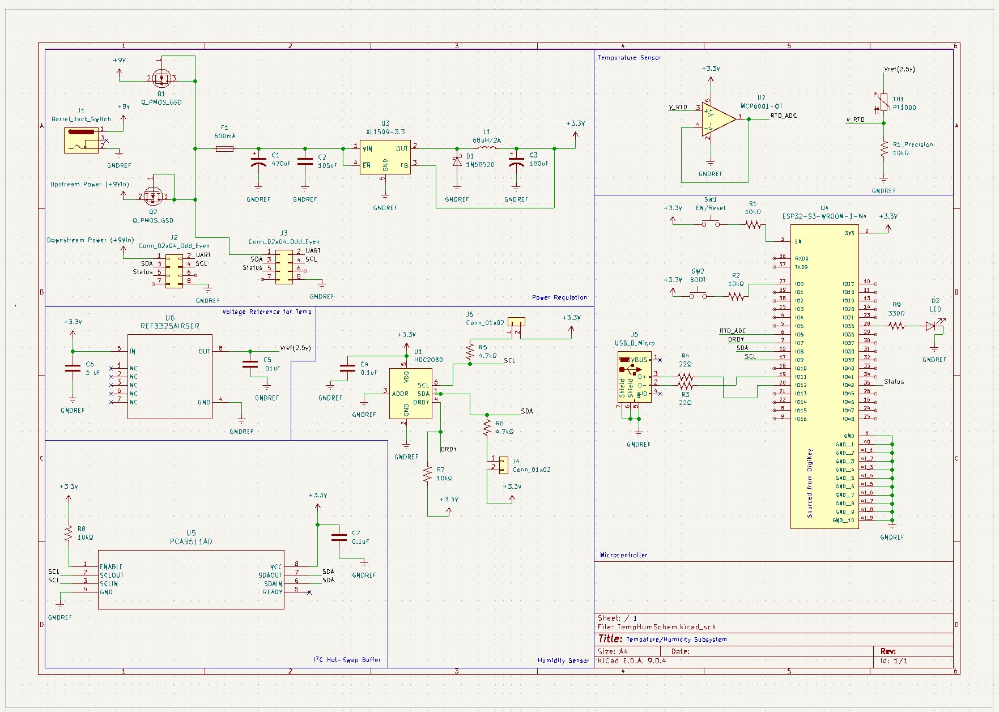

## Overview

This schematic supports the implementation of the Temperature and Humidity Subsystem module. The board can be powered either independently using a 9V wall adapter or through the team’s shared 9V system rail. These two inputs are combined using P-channel MOSFET power OR-ing, which prevents reverse current flow between sources.

The combined 9V rail (system rail) is passed through to the downstream board in the system. A local fuse protects only this board’s circuitry from overcurrent conditions. The fused 9V rail is then regulated down to 3.3V using a switching regulator (buck converter).

The 3.3V rail powers the ESP32 microcontroller and all onboard sensors.

The humidity sensor (HDC2080) communicates with the ESP32 over the I²C bus. An I²C hot-swap buffer (PCA9511A) isolates the local I²C bus from the system bus, allowing the board to be safely connected or disconnected without disturbing the rest of the system.

Temperature is measured using a PT1000 resistance temperature detector (RTD). The RTD is driven from a precision 2.5V voltage reference to improve measurement stability and accuracy. The RTD forms a voltage divider with a precision resistor. The resulting voltage is buffered and measured by the ESP32’s ADC to determine the probe’s resistance and corresponding temperature.

{style width:"350" height:"300;"}
**Figure 1:** Temperature/Humidity Subsystem schematic.

## Resouces

The schematic as a PDF download is available [*here*](TempHumP.pdf), and the Zip folder of the project [*here*](⁓TempHumSchem.kicad_sch.zip).
