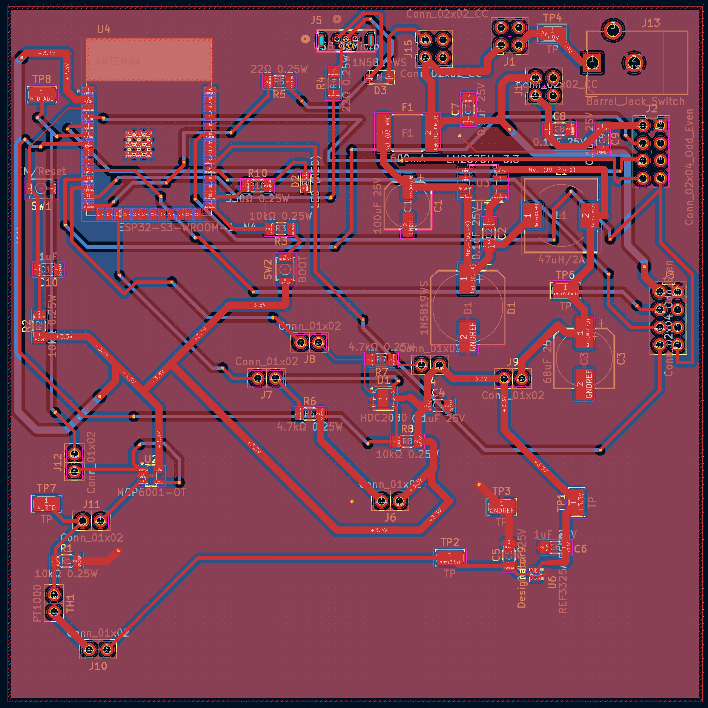

## Overview
This page exists to describe and provide resources for viewing and downloading the PCB required for the temperature/humidity subsystem
## PCB

{style width:"350" height:"300;"}
**Figure 1:** Temperature/Humidity Subsystem PCB.

## Resources
A PDF is availible for download[*here*](PCBPDF.pdf)
The gerber files for manufacturing are availible for download here[*here*](TempHumSchemGBR.zip).
